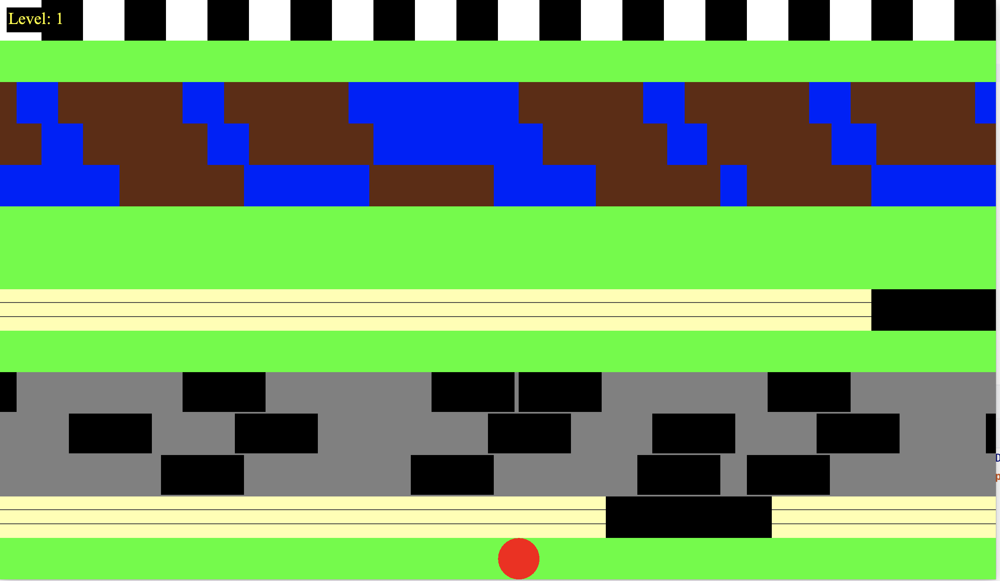
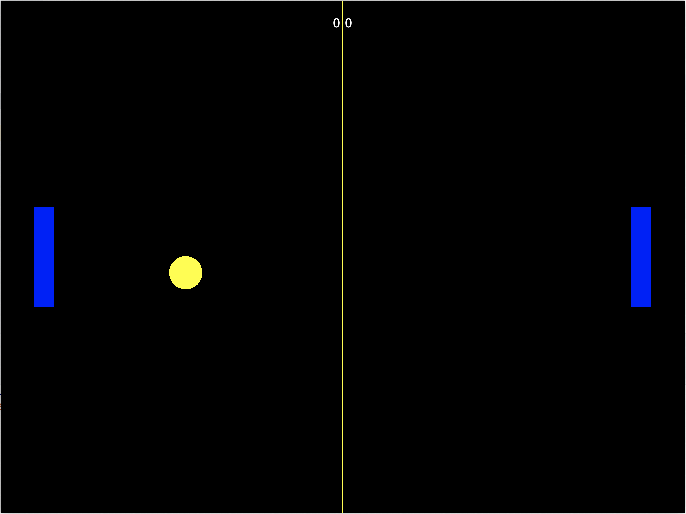

Little Java games I'm doing with my sons.

They all run in Java 21.

# Fantasy

A tiny Zelda like game.

Controls:
* Up: Move up
* Down: Move down
* Left: Move left
* Right: Move right
* Escape: Exit

# Frogger

A simple Frogger like game.

Controls:
* Up: The red circle moves up
* Down: The red circle moves down
* Right: The red circle moves right
* Left: The red circle moves left
* Escape: Exit

# Learn

Classical snake.

Controls:
* Up: Move up
* Down: Move down
* Left: Move left
* Right: Move right
* Escape: Exit

# Multi memory

To learn multiplication tables.

You click on the right answer.

# Pong

The classic Pong game with 2 players.

Controls:
* Up: Right player goes up
* Down: right player goes down
* W: Left play goes up
* S: Left player goes down
* Space: Restart
* Escape: Exit

# Snake

Snake.io like game.

Controls:
* Move the mouse, the snake will follow
* Shift: It will boost the snake speed but remove a ring when doing it for too long
